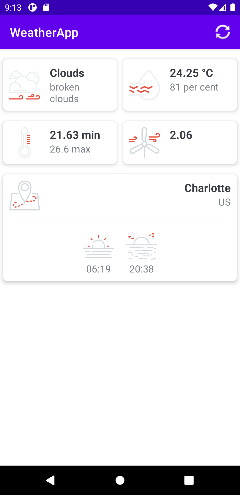

# Weather app
## Details and Description
### Functionality
Weather app alows you:
* access your current location and show wheather details for the current loaction from [Open Weather API](https://openweathermap.org/):
    * weather condition
    * current temperature
    * min/max temperature
    * humidity
    * wind speed
    * current location
    * sunrise/sunset time
* click refresh button to get new weather details when location has changed

### App is using
* 1 activity: 
    * MainActivity - Main screen where user is able to see the weather data about current location and refresh button
* Custom Dialog with progress bar to show loading proccess when data is being fetched
* Fused Location Provider for Android to get current location
* Dexter - Requests permissions:
    * to use internet, wi-fi and network state to get data from API
    * to access current user location
* Retrofit - HTTP client for Android:
    * created WeatherService interface to access weather data with GET API call
* Gson library:
    * created multiple models to map data from json response to object

### Challenges

* Functionality of refresh button - get location weather details for new location after location has changed. Work with FusedLocationProviderClient from Fused Location Provider for Android.

### Screenshots

